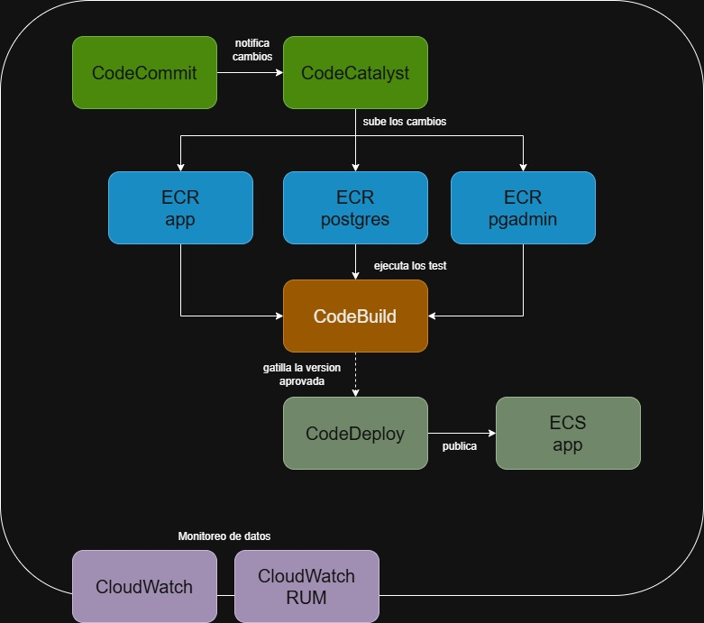

# Segunda Evaluación Sumativa — Introducción a DevOps

**Curso:** Introducción a DevOps — UCN Coquimbo  
**Integrantes:** Diego Contreras, Ian

---

## Parte 1: Integración Continua y Despliegue Continuo

Aplicación backend en **Go** con almacenamiento en memoria que gestiona registros de personas.

### Rutas disponibles

| Método | Ruta | Descripción |
|---|---|---|
| `GET` | `/personas` | Retorna todas las personas |
| `POST` | `/personas` | Agrega una persona |
| `DELETE` | `/personas/{rut}` | Elimina una persona por RUT |

### Modelo de datos

```json
{
  "nombre": "Juan Pérez",
  "rut": "12345678-9",
  "fecha_nacimiento": "1990-05-20",
  "ciudad": "Santiago",
  "gustos": ["fútbol", "pizza", "películas"]
}
```

### Ejecutar localmente

```bash
cd backend
go run .
```

El servidor levanta en `http://localhost:8080` por defecto. Se puede cambiar el puerto con la variable de entorno `PORT`.

### Ejecutar tests

```bash
cd backend
go test ./... -v
```

### Despliegue

La aplicación está desplegada en **Azure App Service** con CI/CD via GitHub Actions.  
URL: https://pruebadevops-chahgwgxawgafnf4.canadacentral-01.azurewebsites.net  
Swagger UI: https://pruebadevops-chahgwgxawgafnf4.canadacentral-01.azurewebsites.net/swagger/index.html

### Link Video

https://drive.google.com/drive/folders/1gKgYxFyY-gt3xpPZ03l_YN3s26rj2Lk4?usp=drive_link

---

## Parte 2: Orquestación de Contenedores

La aplicación fue migrada para usar **PostgreSQL** como base de datos persistente, orquestada con Docker Compose junto a **pgAdmin** como visor de base de datos.

### Servicios

| Servicio | Imagen | Puerto | Descripción |
|---|---|---|---|
| `app` | Build local (`./backend`) | `8080` | API Go conectada a PostgreSQL |
| `postgres` | `postgres:16-alpine` | `5432` (interno) | Base de datos relacional |
| `pgadmin` | `dpage/pgadmin4:8` | `5050` | Visor web de la base de datos |

### Límites de recursos

| Servicio | CPU | Memoria |
|---|---|---|
| `app` | 0.50 | 128 MB |
| `postgres` | 0.50 | 256 MB |
| `pgadmin` | 0.25 | 256 MB |

### Variables de entorno

Copiar `example.env` como `.env` antes de levantar:

```bash
cp example.env .env
docker compose up --build -d
```

### Acceso local

| Servicio | URL | Credenciales |
|---|---|---|
| API | `http://localhost:8080/personas` | — |
| Swagger UI | `http://localhost:8080/swagger/index.html` | — |
| pgAdmin | `http://localhost:5050` | `admin@admin.com` / `admin` |

### Conectar pgAdmin a PostgreSQL

En pgAdmin → **Add New Server**:

| Campo | Valor |
|---|---|
| Host | `postgres` |
| Port | `5432` |
| Database | `personas_db` |
| Username | `personas` |
| Password | `secret` |

---

## Parte 3: Cloud DevOps

### AWS (Amazon Web Services)

AWS (Amazon Web Services) es una plataforma de computación en la nube que ofrece un amplio catálogo de servicios para el desarrollo, despliegue y administración de aplicaciones. Sus soluciones abarcan distintos modelos de servicio:

- IaaS (Infrastructure as a Service): proporciona infraestructura como servidores, redes y almacenamiento, permitiendo administrar desde el entorno de ejecución hasta la aplicación. Un ejemplo es implementar una base de datos o una aplicación gestionando la infraestructura subyacente.
- PaaS (Platform as a Service): permite desarrollar y desplegar aplicaciones sin necesidad de administrar la infraestructura donde se ejecutan.
- SaaS (Software as a Service): entrega aplicaciones listas para ser utilizadas por el usuario final, como Gmail o Microsoft Office 365.

Actualmente, AWS dispone de más de 200 servicios en la nube, permitiendo cubrir todas las etapas del ciclo de vida del desarrollo de software.

### Planificación: Amazon CodeCatalyst

Aunque este servicio dejó de aceptar nuevos clientes desde el año pasado, continúa siendo una referencia como entorno de planificación para proyectos de software.

#### Entre sus principales características se encuentran:

- Uso de Blueprints como plantilla base para crear proyectos.
- Selección del stack tecnológico y de servicios de AWS.
- Gestión de flujos de trabajo compatibles con metodologías CI/CD.
- Administración de tareas mediante tableros tipo Kanban.
- Definición de dependencias y ejecución de tareas en paralelo.

### Codificación: Amazon CodeCommit

Servicio de control de versiones basado en Git, diseñado para alojar repositorios privados de código fuente.

#### Sus principales características son:

- Integración con otros servicios de AWS.
- Trabajo colaborativo entre múltiples desarrolladores.
- Administración segura del código fuente.

### Construcción: Amazon Elastic Container Registry (ECR)

Amazon ECR es un registro de contenedores administrado que permite almacenar imágenes de Docker de forma remota.

#### Se utiliza principalmente para:

- Almacenar imágenes de contenedores.
- Compartir imágenes entre distintos servicios de AWS.
- Preparar imágenes para futuros despliegues o pruebas.

### Pruebas: Amazon CodeBuild

Servicio de integración continua encargado de compilar el código y ejecutar pruebas automatizadas.

#### Sus funciones incluyen:

- Compilación automática del proyecto.
- Ejecución de pruebas mediante el archivo de configuración buildspec.yml.
- Soporte para pruebas en contenedores.
- Visualización de resultados, tiempos de ejecución y estado de las pruebas mediante un panel de monitoreo.

### Lanzamiento y despliegue:

### Amazon CodeDeploy

Automatiza el proceso de despliegue de aplicaciones hacia distintos servicios de AWS, reduciendo la intervención manual durante la publicación de nuevas versiones.

### Amazon Elastic Container Service (ECS)

Servicio encargado de ejecutar y administrar contenedores.

#### Entre sus responsabilidades se encuentran:

- Despliegue de imágenes almacenadas en Amazon ECR.
- Configuración de servidores de alojamiento.
- Administración de certificados y DNS.
- Escalado y ejecución de contenedores en producción.

### Operación y monitoreo: Amazon CloudWatch

Servicio de monitoreo y observabilidad que recopila métricas, registros y eventos generados por la infraestructura y las aplicaciones.

#### Permite:

- Visualizar métricas mediante dashboards.
- Monitorear registros del sistema.
- Configurar alarmas.
- Automatizar acciones como el escalado de recursos según el comportamiento de la aplicación.

### Retroalimentación: Amazon CloudWatch RUM (Real User Monitoring)

CloudWatch RUM recopila información directamente desde la experiencia del usuario final, permitiendo analizar el comportamiento real de la aplicación.

#### Entre los datos recopilados se encuentran:

- Tiempo de carga y respuesta.
- Errores durante la interacción del usuario.
- Problemas relacionados con formularios e inputs.
- Errores presentes en la interfaz gráfica (GUI).

Esta información facilita la identificación de problemas de rendimiento y experiencia de usuario en entornos de producción.

### Diagrama implementado



### Tabla de comparaciones

---

| Categoria | Clases | AWS | Similitud |
|---------|---------|---------|---------|
| 1. Control de Versiones | GitHub: Estándar de la industria con comunidad masiva | Amazon CodeCommit: Nativo de AWS, integrado con IAM, mejor para ambientes cerrados de AWS. | Ambos son repositorios Git basados en la nube que permiten control de versiones distribuido, colaboración en tiempo real, gestión de ramas y pull requests/merge requests para revisión de código. |  
| 2. Orquestación CI/CD | Jenkins: Altamente personalizable con plugins, requiere mantenimiento. | Amazon CodeCatalyst: Servicio administrado, configuración visual o YAML, integración nativa con AWS. | Ambos orquestan pipelines de CI/CD, permitiendo automatización de builds, tests y despliegues. Soportan Pipeline as Code para definir flujos versionados. |
| 3. Análisis de Código | SonarQube: Análisis estático tradicional, Community Edition gratuita, altamente customizable. | Amazon CodeGuru: Análisis basado en IA/ML, recomendaciones automáticas, integrado en CodeCatalyst. | Ambos analizan la calidad del código, detectan vulnerabilidades de seguridad, identifican bugs potenciales y generan reportes de cobertura de tests. |
| 4. Motor de Contenedores | Docker: Motor de ejecución de contenedores, estándar universal. | ECR: Solo registro, necesita Docker/motor de contenedores aparte, integrado con ECS/EKS. | Ambos trabajan con contenedores. Docker crea/ejecuta. ECR es un registro que almacena imágenes de contenedores. |
| 5. Orquestación de Contenedores | Kubernetes: Multi-cloud, altamente flexible, complejidad alta. | Amazon ECS: Solo AWS, más simple de usar, menor curva de aprendizaje, integración directa con servicios AWS. | Ambos orquestan y manejan contenedores a escala en producción, automatizando deployment, scaling, balanceo de carga y health checks. |
| 6. Infraestructura como Código (IaC) | Terraform: Agnóstico a cloud (AWS, Azure, GCP, etc.), lenguaje HCL propio. | AWS CloudFormation: Solo AWS, usa JSON/YAML, incluido en AWS sin costo adicional. | Ambos definen infraestructura mediante código en formato declarativo, versionan la infraestructura, permiten replicabilidad y automatización del deployment. |
| 7. Gestión de Configuración | Ansible: Sin agentes (SSH), YAML simple, multi-cloud. | AWS Systems Manager + OpsWorks: Basado en agentes SSM, integración profunda con AWS, OpsWorks para Chef/Puppet. | Ambos automatizan la configuración de servidores, garantizan estado deseado (idempotencia), pueden ejecutar comandos y configurar múltiples máquinas. |
| 8. Logging y Análisis | ELK Stack: Requiere infraestructura propia, visualizaciones avanzadas customizables, mejor para análisis profundo. | Amazon CloudWatch: Administrado por AWS, integrado nativamente, configurable con menos esfuerzo. | Ambos centralizan logs de aplicaciones y sistemas, permiten búsqueda y análisis de logs, generan insights de eventos y errores. |
| 9. Métricas y Monitoreo | Prometheus + Grafana: Open source, máxima customización, excelente para Kubernetes. | Amazon CloudWatch: Integrado con AWS, métricas automáticas de servicios AWS, alertas integradas con SNS/SQS. | Ambos recopilan métricas de sistemas y aplicaciones, generan dashboards, permiten alertas basadas en umbrales, visualizan tendencias en tiempo real. |

---